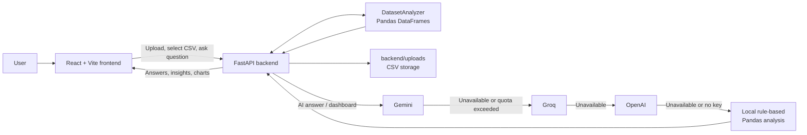

# AI-Powered Data Analyst

> Upload a CSV, choose a dataset, and turn its data into answers, insights, anomaly checks, and charts.


<p align="center">
  <a href="#features">Features</a> ·
  <a href="#quick-start">Quick Start</a> ·
  <a href="#configuration">Configuration</a> ·
  <a href="#architecture">Architecture</a> ·
  <a href="#how-to-use">How to Use</a>
</p>

---

## What it does

AI-Powered Data Analyst is a full-stack application for exploring CSV files without writing analysis code. Each uploaded CSV remains independent: when you select a dataset, the chat, insights, anomalies, charts, custom chart builder, and dashboard all use that file only.

## Features

| Area | Included capabilities |
| --- | --- |
| CSV management | Upload multiple CSV files, select one dataset, and remove files when finished. |
| AI analysis | Ask questions in plain language and receive dataset-specific answers, reasoning, code, and chart data where relevant. |
| Instant insight | View data summaries, missing values, duplicates, key metrics, trends, and category breakdowns. |
| Visual analysis | See suggested charts or build bar, line, pie, and scatter charts from selected columns. |
| Data quality | Detect missing-value issues, duplicates, negative values, and numerical outliers. |
| Reliable responses | Uses Gemini, then Groq, then OpenAI, then a local Pandas-based fallback. |

## Sample Datasets

The following CSV files are included in the [`datasets/`](datasets) folder for testing. Upload them through the interface to explore the application.

| Dataset | Size | What you can explore |
| --- | ---: | --- |
| `emails.csv` | 5,172 rows · 3,002 columns | Email classification data with term-frequency features. |
| `fifa_world_cup_2026_player_performance.csv` | 54,600 rows · 75 columns | Player profiles, team details, match performance, and football statistics. |
| `social_media_screentime_mental_health_2026.csv` | 7,000 rows · 25 columns | Screen-time habits, platform use, demographics, and mental-health indicators. |
| `bitcoin_price_Training - Training.csv` | 1,556 rows · 7 columns | Historical Bitcoin price data: open, high, low, close, volume, and market cap. |
| `titanic.csv` | 418 rows · 2 columns | Passenger identifiers and survival outcomes. |

These files are particularly useful for testing different analysis patterns:

- **Classification and high-dimensional data:** emails
- **Rankings and performance comparisons:** FIFA player performance
- **Behavioral trends and grouped analysis:** social media and mental health
- **Time-series charts and trend questions:** Bitcoin prices
- **Outcome counts and percentages:** Titanic survival

## Architecture



## Quick Start

### Prerequisites

- Python 3.10+
- Node.js 18+
- An API key for Gemini, Groq, or OpenAI is optional. The local fallback remains available without one.

### 1. Install backend dependencies

```powershell
python -m venv .venv
.\.venv\Scripts\Activate.ps1
python -m pip install -r backend\requirements.txt
```

### 2. Configure an AI provider

Create `backend/.env`:

```env
# Add one or more providers. They are tried in this order.
GEMINI_API_KEY=your_gemini_key
GROQ_API_KEY=your_groq_key
OPENAI_API_KEY=your_openai_key

# Optional: this is the default Groq model.
GROQ_MODEL=llama-3.3-70b-versatile
```

> Keep this file private. It is already excluded by `.gitignore`.

### 3. Start the backend

```powershell
cd backend
..\.venv\Scripts\python.exe -m uvicorn main:app --reload --host 127.0.0.1 --port 8000
```

The API is now available at [http://localhost:8000/docs](http://localhost:8000/docs).

### 4. Start the frontend

Open a second terminal:

```powershell
cd frontend
npm install
npm run dev
```

Open the Vite address shown in the terminal, usually [http://localhost:5173](http://localhost:5173).

## Configuration

The frontend connects to `http://localhost:8000` by default. To point it to a different backend, create `frontend/.env.local`:

```env
VITE_API_URL=http://localhost:8000
```

### AI fallback order

```text
Gemini  →  Groq  →  OpenAI  →  Local Pandas analysis
```

Provider availability and errors are logged by the backend without printing API key values. If a provider is unavailable, the application automatically moves to the next one.

## How to Use

1. Upload one or more `.csv` files.
2. Use the **Dataset Summary** dropdown to choose the file to analyze.
3. Ask a suggested question or enter your own in **Ask AI**.
4. Review file-specific insights, anomaly checks, and suggested charts.
5. Create a custom chart or generate a dashboard for the selected CSV.

## Useful Commands

| Task | Command |
| --- | --- |
| Run backend | `cd backend; ..\.venv\Scripts\python.exe -m uvicorn main:app --reload` |
| Run frontend | `cd frontend; npm run dev` |
| Build frontend | `cd frontend; npm run build` |
| Check backend syntax | `.\.venv\Scripts\python.exe -m compileall -q backend` |

## Project Structure

```text
AI-Powered-Data-Analyst/
├── backend/
│   ├── main.py          FastAPI application and environment loading
│   ├── routes.py        Upload, chat, chart, and dashboard endpoints
│   ├── analyzer.py      CSV summaries, insights, anomalies, and chart suggestions
│   ├── utils.py         Gemini → Groq → OpenAI → local fallback chain
│   └── uploads/         Runtime CSV uploads (ignored by Git)
├── frontend/
│   ├── src/             React UI components and API client
│   └── package.json     Frontend dependencies and scripts
├── datasets/             Included sample CSV files
├── .gitignore
└── README.md
```

---

Built with FastAPI, Pandas, React, Vite, and Recharts.
